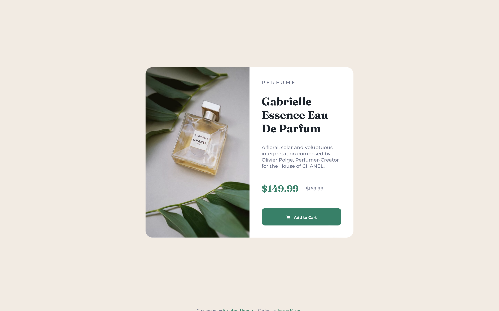
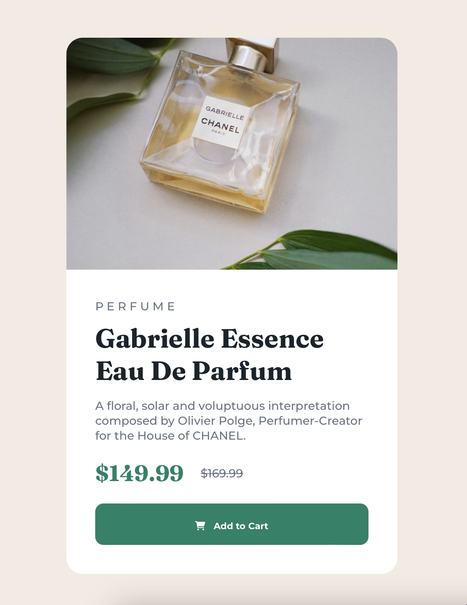

# Frontend Mentor - Product preview card component solution

This is a solution to the [Product preview card component challenge on Frontend Mentor](https://www.frontendmentor.io/challenges/product-preview-card-component-GO7UmttRfa).

## Table of contents

- [Frontend Mentor - Product preview card component solution](#frontend-mentor---product-preview-card-component-solution)
  - [Table of contents](#table-of-contents)
  - [Overview](#overview)
    - [The challenge](#the-challenge)
    - [Screenshot](#screenshot)
    - [Links](#links)
  - [My process](#my-process)
    - [Built with](#built-with)
    - [What I learned](#what-i-learned)
    - [Useful resources](#useful-resources)
  - [Author](#author)

## Overview

### The challenge

Users should be able to:

- View the optimal layout depending on their device's screen size
- See hover and focus states for interactive elements

### Screenshot




### Links

- Solution URL: [Solution](https://github.com/maudlinmandrake/product-preview-card-component)
- Live Site URL: [Live](https://maudlinmandrake.github.io/product-preview-card-component)

## My process

### Built with

- Semantic HTML5 markup
- CSS custom properties
- Flexbox
- Visual Studio Code

### What I learned

Use this section to recap over some of your major learnings while working through this project. Writing these out and providing code samples of areas you want to highlight is a great way to reinforce your own knowledge.

```html

```

### Useful resources

- [Complete guide to Flexbox](https://css-tricks.com/snippets/css/a-guide-to-flexbox/) - Great reference for Flexbox
- [Responsive Images: Reference Guide](https://imagekit.io/responsive-images/) - Extremely comprehensive guide to respomsive images

## Author

- Website - [Jenny Mikac](https://www.jennymikac.com)
- Frontend Mentor - [@ymaudlinmandrake](https://www.frontendmentor.io/maudlinmandrake)
- Twitter - [@jennymikac](https://www.twitter.com/jennymikac)
